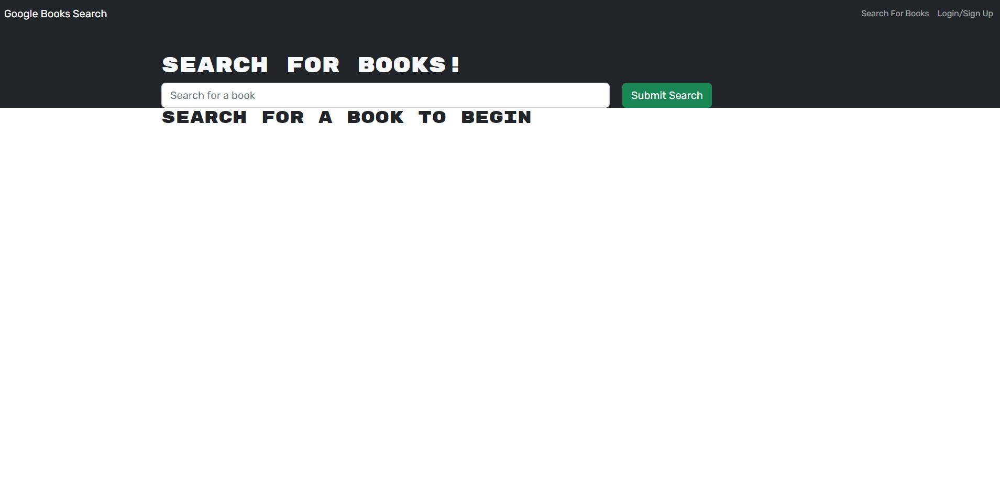

# Book Search Engine Starter Code
      

  
  ## Description
  The Book Search Engine shows some of my newly learned skills working with refactoring a working RESTful API application to be a GraphQL API built with Apollo Server. 
  
  ## Table of Contents
  * [Installation](#installation)
  * [Usage](#usage)
  * [Credits](#credits)
  * [License](#license)
  * [Contributing](#contributing)
  * [Questions](#questions)

  ## Installation
  Download and install folder, install node and run npm i, then npm start in the integrated terminal. Then go to your localhost in browser.

  Github Repository: https://github.com/kristermyr/BookSearchEngine
  Heroku: https://kristersbooksearchengine.herokuapp.com/

  ## Usage
  
  

  ## Credits
    https://github.com/sylviaprabudy/book-search-engine
    AskBCS - Sebastian 
    Class activities
    MERN mini-project

  ## Collaborators
 *  Dylan Quaale https://github.com/dylanquaale/book-search-engine/tree/main/client/src

  ## License
  MIT

  ## Contributing
  Create a new branch and submit a pull request

  ## Questions
  Github Username: kristermyr
  Please send me an E-mail if you have any questions [here](mailto:krister90@gmail.com) or visit https://github.com/kristermyr

